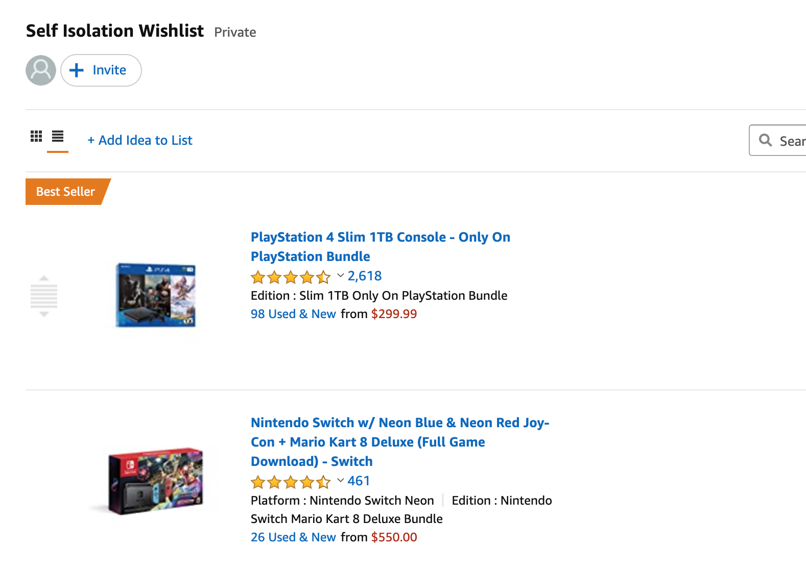
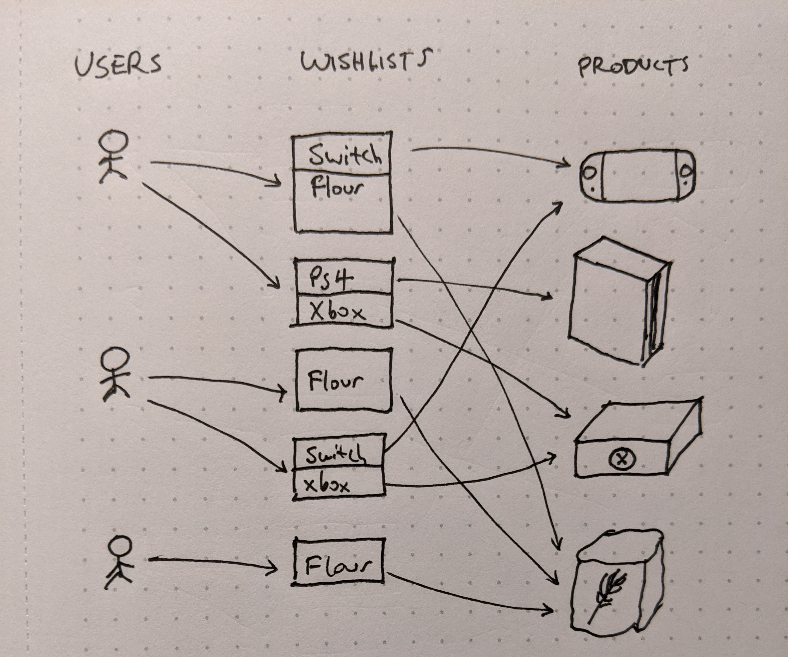
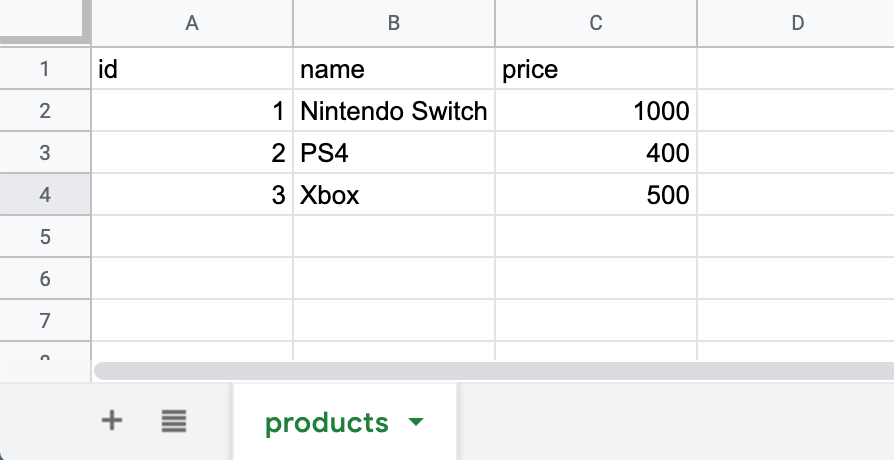
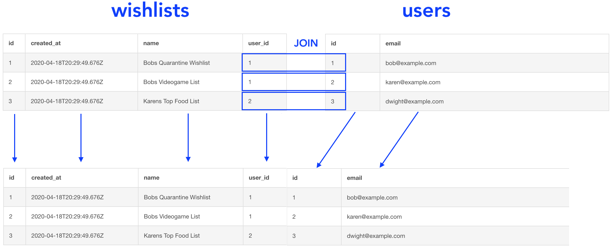
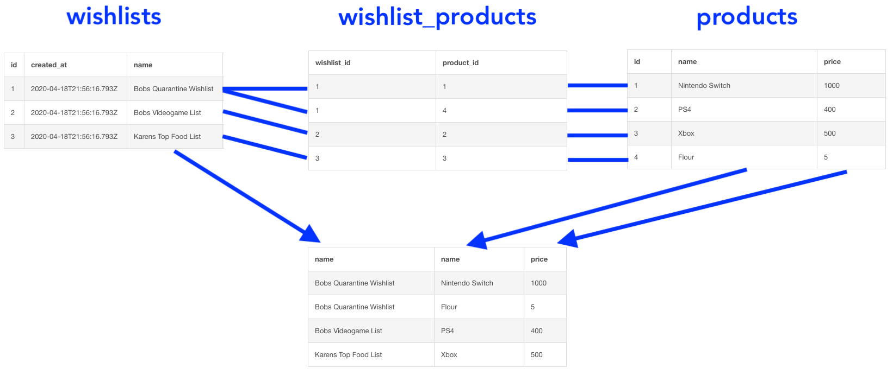
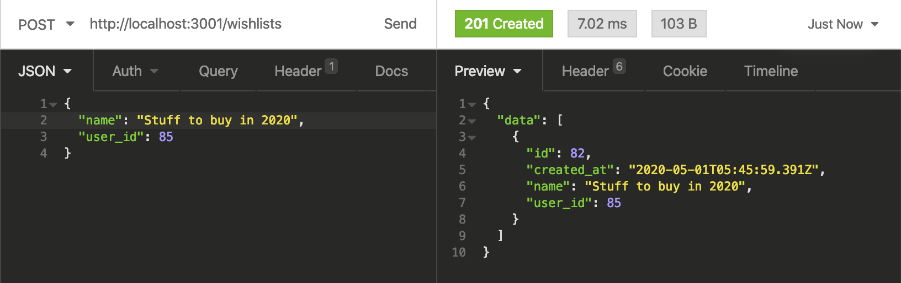
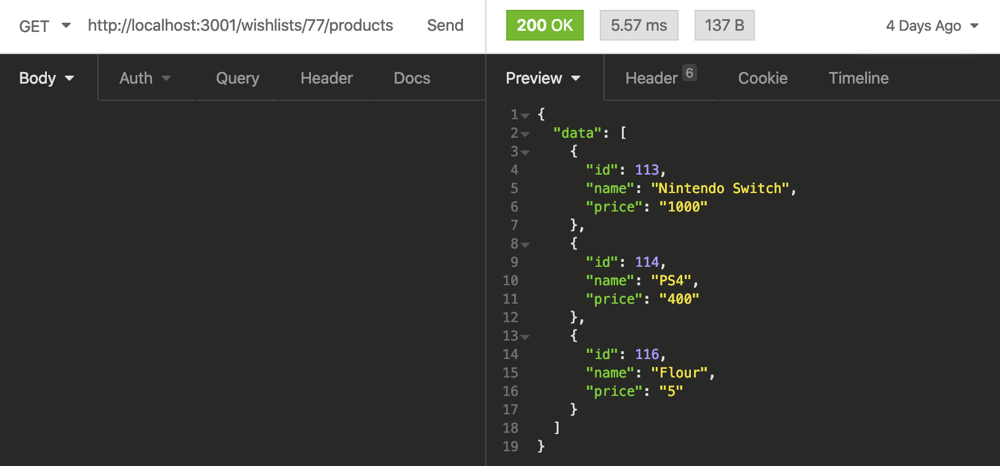

# How to database - an intro to SQL databases for building web apps

## Agenda (~45 min)

**Part 1: Designing a database to support an "Amazon wishlists" feature**

- Creating tables and querying them
- One-to-many and many-to-many relationships
- JOINs

**Part 2: Using a relational database in a NodeJS app**

- Migrations
- Building SQL queries in code with Knex
- Building RESTful API endpoints to create and fetch wishlist data

## Why use a relational database to build web apps?

I've noticed that especially with Node apps, MongoDB seems like a common and convenient default pick for storing data. But in my opinion, when building a typical web app, using a relational database is a better choice long term, because it's a usually a better fit for the underlying structure of your data. I'll talk about this more at the end once we've covered some database concepts.

Among relational databases, PostgreSQL and MySQL are both solid choices and widely used at tech companies. We're going to use PostgreSQL today.

## 1. Designing a database to support an "Amazon wishlists" feature

First, let's create a database and look at the raw SQL commands we'll be using later. Understanding the underlying SQL commands can be useful because it transfers across any language or framework you'll be using on top of the database.

### Creating tables, inserting data, and querying them

Your product manager has asked you to build a product wishlist feature. They hand you a mockup of the UI, which just looks like a screenshot taken from Amazon:



Let's think about what types of data we'll need to support this. We'll have a bunch of products for sale, with price and name and so on. We'll also be supporting multiple users in the system, each of which can have many wishlists, and each wishlist which can contain many products.



We see three different types of data we want to store in the database - products, users, and wishlists. To store each type of data, we'll create a "table" for it.

A table is sort of like a spreadsheet. A spreadsheet that stores products, for example, would have columns for id, name, and price - and each row represents a different product.



These are the SQL commands to create tables for products, users, and wishlists:

```sql
CREATE TABLE products (
  id SERIAL PRIMARY KEY,
  name TEXT NOT NULL,
  price DECIMAL NOT NULL
);

CREATE TABLE users (
  id SERIAL PRIMARY KEY,
  email TEXT NOT NULL
);

CREATE TABLE wishlists (
  id SERIAL PRIMARY KEY,
  created_at TIMESTAMP WITH TIME ZONE DEFAULT NOW(),
  name TEXT NOT NULL
);
```

We're going to put these queries into [db-fiddle.com](https://www.db-fiddle.com/), which is a handy online tool that lets us create database tables and run queries on them.

In each CREATE TABLE statement, we're defining the columns for that data type. A few details on these columns:

- Each table has an `id` , which we refer to as the "primary key". A primary key is a column (or columns) that uniquely identifies each row in the table. The `PRIMARY KEY` attribute makes them unique integers. `SERIAL` means the ids are auto-generated starting from 1, increasing by 1 each time you add a row. You'll usually want an `id` columns in a table, though there are exceptions to this that we'll see later.
- Q: Why not use something like `[users.email](http://users.email)` as a primary key on the user table?
    - A: One reason is that you'll want your primary keys to be immutable. If you allow users to change the value of a column, you'll be breaking all the references to that primary key.

Let's add some data to these tables using the INSERT command:

```sql
INSERT INTO products (name, price) VALUES
  ('Nintendo Switch', 1000),
  ('PS4', 400),
  ('Xbox', 500),
  ('Flour', 5);

INSERT INTO users (email) VALUES
  ('bob@example.com'),
  ('karen@example.com'),
  ('dwight@example.com');
```

We don't have to insert `id` because of the auto-incrementing `SERIAL` property. "Nintendo Switch" will have id 1, "PS4" will have id 2, and so on.

Now let's query the data using the SELECT statement:

```sql
SELECT * FROM products;
SELECT * FROM users;
```

`SELECT *` means to fetch every column in the table.

Here are the results:

[products](https://www.notion.so/67087f66d0de467a972ca15fad426ba6)

---

[users](https://www.notion.so/c03a6059a80141f7abd75afe50cb0554)

Note that the ids are indeed automatically generated, starting from 1.

Here's a checkpoint db-fiddle for what we have so far: [https://www.db-fiddle.com/f/9t387mTftgt1VB6eEM5Cox/1](https://www.db-fiddle.com/f/9t387mTftgt1VB6eEM5Cox/1)

### Creating user wishlists

We have 3 tables that don't relate to each other yet. How should we store wishlists for a user?


Users and wishlists have a relationship called a **one-to-many** relationship: a user can have many wishlists, and a wishlist belongs to just one user.

✏️ In a one-to-many relationship, we want to add a **foreign key** to the "many" side of the relationship which points to the primary key of the related table. This means we'll want to add a `user_id` column to the wishlists table:

```sql
CREATE TABLE wishlists (
  id SERIAL PRIMARY KEY,
  created_at TIMESTAMP WITH TIME ZONE DEFAULT NOW(),
  name TEXT NOT NULL,
  **user_id INTEGER REFERENCES users(id)**
);
```

This will allow our tables to relate to each other like this:



[Mermaid diagram link](https://mermaid-js.github.io/mermaid-live-editor/#/edit/eyJjb2RlIjoiY2xhc3NEaWFncmFtXG5cbnVzZXIxIDx8LS0gd2lzaGxpc3QxXG51c2VyMSA8fC0tIHdpc2hsaXN0MlxudXNlcjEgPHwtLSB3aXNobGlzdDNcblxuY2xhc3MgdXNlcjEge1xuICBpZCA9IDFcbn1cblxuY2xhc3Mgd2lzaGxpc3QxIHtcbiAgdXNlcl9pZCA9IDFcbn1cblxuY2xhc3Mgd2lzaGxpc3QyIHtcbiAgdXNlcl9pZCA9IDFcbn1cblxuY2xhc3Mgd2lzaGxpc3QzIHtcbiAgdXNlcl9pZCA9IDFcbn0iLCJtZXJtYWlkIjp7InRoZW1lIjoiZGVmYXVsdCJ9LCJ1cGRhdGVFZGl0b3IiOmZhbHNlfQ)

Side note:  `REFERENCES users(id)`  creates a "foreign key constraint" that guarantees that `wishlists.user_id` points to a valid user record. This allows you to have referential integrity, which can be very useful - for example, if you try to delete a user with wishlists, the database won't let you until you delete the wishlists first.

With this new column created, let's insert three wishlists:

```sql
INSERT INTO wishlists (name, user_id) VALUES
  ('Bobs Quarantine Wishlist', 1),
  ('Bobs Videogame List', 1),
  ('Karens Top Food List', 2);
```

Then we can use SELECT to fetch wishlists from the database:

```sql
SELECT * FROM wishlists;
SELECT * FROM wishlists WHERE user_id = 1;
```

`WHERE` filters the wishlist rows to only those that match that user.

We've now established a one-to-many relationship between users and wishlists.

Here's a checkpoint for the SQL we have so far: [https://www.db-fiddle.com/f/kCPUKvJeowsYGnhhni71CL/4](https://www.db-fiddle.com/f/kCPUKvJeowsYGnhhni71CL/4)

### Combining data across multiple tables using a JOIN

We've used SELECT to pull data from a single table, but what if we want to combine data together from multiple tables? We'll want to use a JOIN.

For example, say we want to create a report which shows every wishlist, along with the user's email address. We'll use the JOIN keyword to combine two tables together through an associated column:

```sql
SELECT * FROM wishlists
**JOIN users ON users.id = wishlists.user_id;**
```

Here's a diagram that shows what this JOIN looks like:



✏️ Joining tables together is one of the key features of relational databases — it's very useful.

Here's a checkpoint of the SQL we have so far: [https://www.db-fiddle.com/f/8WxXTzoDLLfE9iCWjrp9V2/2](https://www.db-fiddle.com/f/8WxXTzoDLLfE9iCWjrp9V2/2)

### Adding products to wishlists

We can now store a user's wishlists, but the wishlists don't keep track of any products yet.

.jpg)

Because a wishlist can contain many products, AND a product can belong to multiple wishlists, this is called a **many-to-many** relationship.

✏️ To store a many-to-many relationship, you'll typically want to create a new table - usually called a "join table". This table stores each relationship (i.e. each of the criss-crossing arrows in the diagram above).

To join wishlists and products, we'll create a new table called `wishlist_products`:

```sql
CREATE TABLE wishlist_products (
  wishlist_id INTEGER REFERENCES wishlists(id),
  product_id INTEGER REFERENCES products(id)
);
```

Side note: because it's only responsible for connecting tables, join tables don't need an explicit `id` primary key.

Let's fill in some data into this new table, which adds a few items to each wishlist:

```sql
INSERT INTO wishlist_products (wishlist_id, product_id) VALUES
  (1, 1),  -- Add Nintendo Switch to wishlist 1
  (1, 4),
  (2, 2),
  (3, 3);
```

Now let's make use of this join table. Let's imagine we wanted to write a single SQL query to fetch the data needed on this page. We're going to need data from both the wishlists table and the products table.


To do this, we'll need to write a SELECT statement that JOINs the wishlists table with the wishlist_products table and then with the products table:

```sql
SELECT 
  wishlists.name, 
  products.name,
	products.price
FROM wishlists
JOIN wishlist_products ON wishlist_products.wishlist_id = wishlists.id
JOIN products ON products.id = wishlist_products.product_id;
```

This is a diagram of what that JOIN looks like:



To recap: wishlists and products relate to each other in a "many-to-many" relationship. We can use a "join table" to store the connection between a wishlist and a product, and then use that in SELECT queries.

Here's the db-fiddle checkpoint: [https://www.db-fiddle.com/f/iGBQoZ9BQrxEwmmWQGoaf/3](https://www.db-fiddle.com/f/iGBQoZ9BQrxEwmmWQGoaf/3)

## Part 2: Using relational databases in a Node app

Now that we have some understanding of how our tables look and how to query data from them using raw SQL, let's see what it looks like to use a SQL database in a real web app.

I've built a Node app to demonstrate the concepts, which you can check out at [https://github.com/NodeSchoolSF/how-to-database](https://github.com/NodeSchoolSF/how-to-database)

The app we'll build is a REST API built on NodeJS and Express. Here are some of the routes:

```
# Create wishlist
POST /wishlists
{ name: "Stuff to buy in 2020", user_id: 2 }

# Add product to a wishlist
POST /wishlists/:id/products
{ product_id: 4 }

# List all wishlists for a user id
GET /wishlists?user_id=2

# List all products for a wishlist
GET /wishlists/:id/products
```

Side note: you'll also want to have PUT endpoints to update records and DELETE endpoints to delete them. We won't cover those, but they'll be fairly similar to the POST endpoint.

### Using Knex as a SQL query builder

When you use a SQL database in a web app, you'll usually interact with it through a library called an ORM (object-relational mapping). I'll show some examples using **Knex**, which is a query builder for NodeJS, which is a little simpler and closer to the original SQL.

### Creating tables using migrations

Earlier, recall that we had a bunch of `CREATE TABLE` SQL commands. These commands modify the structure or **schema** of the database. When building an app, you'll generally want to modify the schema using "migrations" - these are sets of SQL commands that change the database schema.

The first migration we'll write is one that creates the same tables we used in part 1 - products, users, wishlists, and the join table.

Knex helps you manage migrations. The command `knex migrate:make create_tables` generates a timestamped file, `db/migrations/20200425150840_create_tables.js` which we can then filled out with SQL commands:

```jsx
exports.up = function (knex) {
  return Promise.all([
    knex.schema.raw(`
      CREATE TABLE products (
        id SERIAL PRIMARY KEY,
        name TEXT NOT NULL,
        price DECIMAL NOT NULL
      );
    `),
    knex.schema.raw(`
      CREATE TABLE users (
        id SERIAL PRIMARY KEY,
        email TEXT NOT NULL
      );
    `),
    knex.schema.raw(`
      CREATE TABLE wishlists (
        id SERIAL PRIMARY KEY,
        created_at TIMESTAMP WITH TIME ZONE DEFAULT NOW(),
        name TEXT NOT NULL,
        user_id INTEGER REFERENCES users(id)
      );
    `),
    knex.schema.raw(`
      CREATE TABLE wishlist_products (
        wishlist_id INTEGER REFERENCES wishlists(id),
        product_id INTEGER REFERENCES products(id)
      );
    `),
  ]);
};
```

Once we have this, we can run `knex migrate:latest` to execute these commands, which creates the tables.

To verify this, we can connect to the database using **psql**, an interactive console where you can execute SQL commands.

In psql, `\d` lists all the tables we have:

```
how_to_database=# \d
                             List of relations
 Schema |              Name              |   Type   |        Owner
--------+--------------------------------+----------+----------------------
 public | knex_migrations                | table    | how_to_database_user
 public | knex_migrations_id_seq         | sequence | how_to_database_user
 public | knex_migrations_lock           | table    | how_to_database_user
 public | knex_migrations_lock_index_seq | sequence | how_to_database_user
 **public | products                       | table    | how_to_database_user**
 public | products_id_seq                | sequence | how_to_database_user
 public | users                          | table    | how_to_database_user
 public | users_id_seq                   | sequence | how_to_database_user
 public | wishlist_products              | table    | how_to_database_user
 public | wishlists                      | table    | how_to_database_user
 public | wishlists_id_seq               | sequence | how_to_database_user
(11 rows)
```

As your app changes, you'll want to add new tables or change existing tables. To do this, you'll want to create a new migration file and then run it, just like we did.

### Creating new records via API

For the sake of time let's assume that we've populated some users and products in our database already, and focus on creating wishlist API endpoints.

Let's look at the javascript code to create a wishlist:

```jsx
const results = await knex("wishlists")
  .insert({ name: "Stuff to buy in 2020", user_id: 3 })
  .returning("*");
```

Knex will convert this into SQL like this and send it to the database:

```sql
insert into "wishlists" ("name", "user_id") values ('Stuff to buy in 2020', 3)
returning *
```

Here's what we get if we `console.log(results)`:

```jsx
{
  id: 82,
  created_at: "2020-05-01T05:45:95.391Z",
  name: "Stuff to buy in 2020",
  user_id: 85
}
```

 The new part, `returning *`, makes it so the query returns the newly inserted record.

What does the full API endpoint look like?

```jsx
router.post("/wishlists", async (req, res) => {
  try {
		// Get parameters from JSON body
    const { name, user_id } = req.body;

		// Validate parameters
    if (!name || !user_id) {
      return res.status(400).json({ error: "missing parameter" });
    }

    **const results = await knex("wishlists")
      .insert({ name, user_id })
      .returning("*");**

		// Return success status and data
    return res.status(201).json({ data: results });
  } catch (err) {
    console.error(err);
    return res.status(500).json({ error: "failed to create user" });
  }
});
```

Side note: normally you don't want to accept the user_id as a parameter and instead use the current user's id. This is for demo purposes.

We can now use a REST client like [Insomnia](https://insomnia.rest/) to POST to [localhost:3001/wishlists](http://localhost:3001/wishlists), which INSERTs a new row into the database, and returns the inserted row:



In order to add products to a wishlist, we'll also want to implement a `POST /wishlists/:id/products` endpoint. This is very similar to the endpoint we just created, so I'll skip it, but you can see the code for it [here](https://github.com/NodeSchoolSF/how-to-database/blob/master/router.js).

### Fetching wishlist data

Now that we can create wishlists with products, let's build the `GET /wishlists/:id/products` endpoint to fetch a list of all the products in a specific wishlist.

Here's the javascript code:

```jsx
const results = await knex("wishlist_products")
  .join("products", "products.id", "wishlist_products.product_id")
  .select("products.*")
  .where("wishlist_products.wishlist_id", 77)
  .orderBy("products.id");
```

Knex converts this to the following SQL:

```sql
select "products".* from "wishlist_products"
inner join "products" on "products"."id" = "wishlist_products"."product_id"
where "wishlist_products"."wishlist_id" = 77
order by "products"."id" asc
```

It's pretty similar to the JOIN queries we've done before. "INNER JOIN" is a synonym for JOIN. It's a good practice to use ORDER BY to explicitly sort your records, because otherwise rows will be returned in an unspecified order and cause unexpected behavior.

What does the full API endpoint look like?

```jsx
router.get("/wishlists/:id/products", async (req, res) => {
  try {
    const wishlistId = req.params.id;

    **const results = await knex("wishlist_products")
      .join("products", "products.id", "wishlist_products.product_id")
      .select("products.*")
      .where("wishlist_products.wishlist_id", wishlistId)
      .orderBy("products.id");**

    return res.status(200).json({ data: results });
  } catch (err) {
    console.error(err);
    return res
      .status(500)
      .json({ error: "failed to retrieve wishlist products" });
  }
});
```

Here's the result of querying the endpoint in a REST client:



### Recap

- We created migrations to execute CREATE TABLE commands to modify our database's schema
- We wrote a `POST /wishlists` endpoint, which inserts new wishlists into the database
- We wrote a `GET /wishlists/:id/products` endpoint, which uses a JOIN to return all the products for a given wishlist.

## Wrapping up

Hopefully this helps you understand relational databases and how to use them. Your PM will be happy (although they'll still want a frontend for this API).

To go back to the question of "a why relational DB?", we can now answer the question a little better. Relational databases better support expressing certain relationships across your data, such as many-to-many relationships (e.g. with products and wishlists), and allow you to query across tables using JOINs. In contrast, document databases like MongoDB don't support JOINs and many-to-many relationships, and may be a worse fit for the typical web app.

Understanding relational databases has been super useful throughout my career. Being able to write queries helps you look at data, find issues, build reports, and more. Being able to design tables and relationships allows you to build complex apps. It's well worth the time to understand it.

All of the content I covered, and the code for the Node app, can be found here:

[https://github.com/NodeSchoolSF/how-to-database](https://github.com/NodeSchoolSF/how-to-database)
